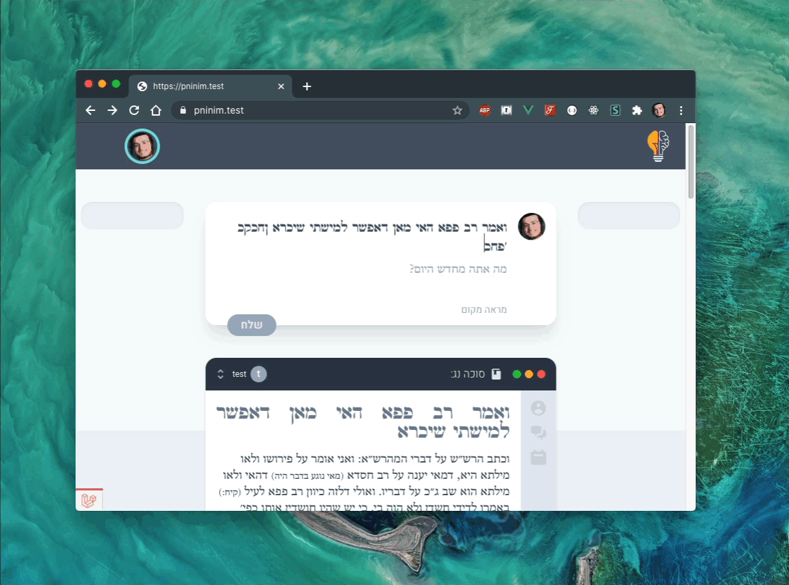

# Vue Auto Resize Directive
A simple directive to make your textareas height automatically grow as the user types some text.



## Installation
Install via NPM:

`npm i vue-auto-resize`

## Usage

### Globaly

To have the directive available inyour whole project, import it in your main entypoint:

```js
import Vue from 'vue'
import AutoSize from 'vue-auto-resize'

Vue.directive('auto-resize', AutoSize)
```

Then you can use the directive on any textarea like so:
```html
<template>
  <div>
    <textarea v-auto-resize></textarea>
  </div>
</template>
```

### Locally

If you only want to make available in one component, you can import it locally:

```html
<template>
  <div>
    <textarea v-auto-resize></textarea>
  </div>
</template>

<script>
  import AutoSize from 'vue-auto-resize'
  export default {
    directives: {
        'auto-resize': AutoSize
     }
  };
</script>
```

The whole thing is only 348 bytes before minification! 😎💡

## License
MIT
